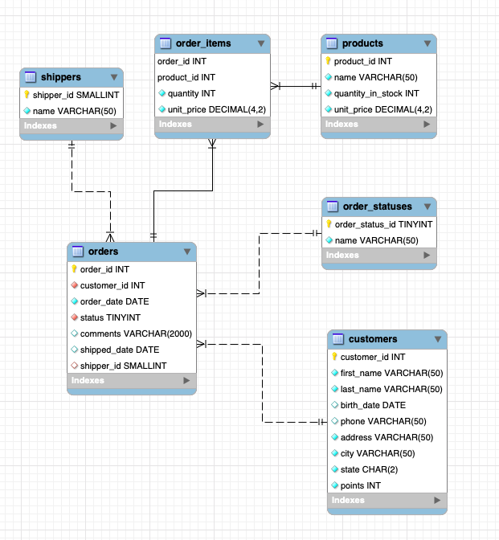
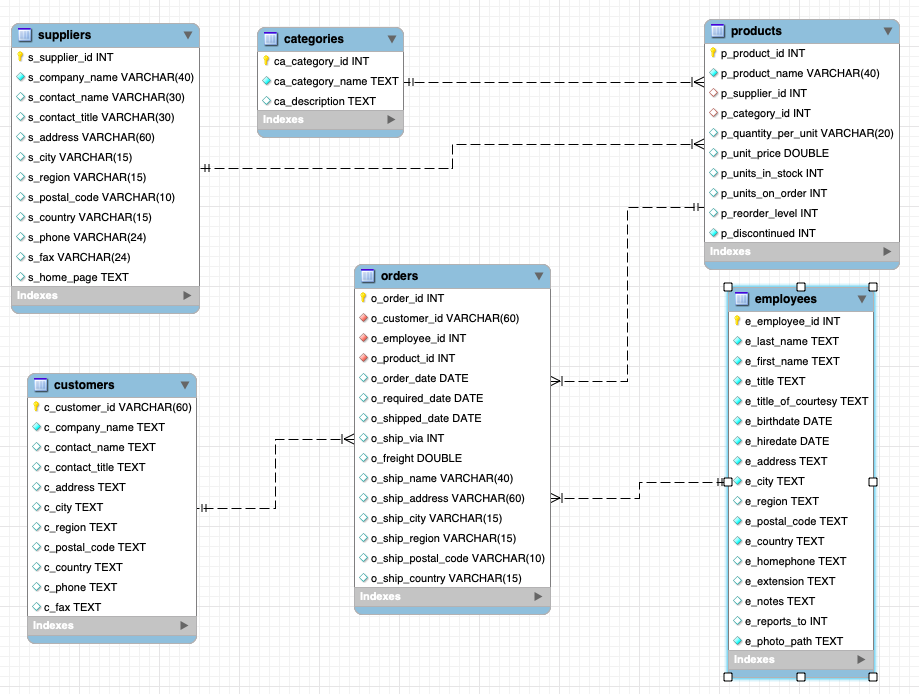

# Data Modelling
This repository includes two projects. store_project and northwind_project. This project is created and tested on MySQL workbench. But I assume other SQL workbenches behave the same.

The project is divided into multiple tasks, 

Task 1 - Import data to SQL database by using python.

Task 2 - Design ETL process to digest the data from MySQL database into a star schema. 

Task 3 - Replicate task 1 into AWS/AZURE/GCP cloud.

Task 4 - Replicate task 2 into AWS/AZURE/GCP cloud.

More tasks to add....

To start with the tasks, clone the repository to your local machine.

# Task 1

## store_project
1. Open `store_schema.sql` in MySQL and run it. It will create the schema 'store_schema'. 

    1.1 You can also change the name of the schema. Just update the name of the schema at the beginning of the .sql file.
   
    1.2 I recommend you to read the `store_schema.sql` file and try to understand how the schema is designed.
    
    1.3 Check the below image and understand how the table is connected.
   

2. Open the `etl_job.py` file in your favorite IDE. Update the database details inside the `etl_job.py`
3. Check the other details and update them as required.
4. Functions used in the `etl_job.py` are written inside `etl_scripts.py`. You must go through each function/method and understand the process.
5. Run the `etl_job.py`. If details are filled in correctly, it will

    5.1 Extract the zip file. The zip file has all the data of store_project.
    
    5.2 Set up the connection between SQL workbench and Python.
    
    5.3 Upload the data from your local machine into store_schema schema.

## northwind_project
1. Open `northwind_schema.sql` in MySQL and run it. It will create the schema 'northwind_schema'. 

    1.1 You can also change the name of the schema. Just update the name of the schema at the beginning of the .sql file.
    
    1.2 I recommend you to read the `northwind_schema.sql` file and try to understand how the schema is designed.
    
    1.3 Check the below image and understand how the table is connected.

2. Open the `etl_job.py` file in your favorite IDE. Update the database details inside the `etl_job.py`.
3. Check the other details and update them as required.
4. Functions used in the `etl_job.py` are written inside `etl_scripts.py`. You must go through each function/method and understand the process.
5. Run the `etl_job.py`. If details are filled in correctly, it will

    5.1 Extract the zip file.
    
    5.2 Set up the connection between SQL workbench and Python.
    
    5.3 Upload the data from your local machine into the northwind_schema schema.

Credits: 
store_project - The store_schema.sql file and the data I use here is taken from https://codewithmosh.com/. 

northwind_project - The northwind data is available on the Internet, and northwind_schema.sql is written/tested by me. 

Both datasets are tweaked a bit by me, so they don't resemble their actual instance.

# Task 2
In task 2, we will create a star schema dimensional model. 
To create a dimension and fact table for the star schema, I have implemented the following steps.

## store_project

1. Open the `star_schema_store.sql` script in your SQL workbench.
2. If you press run, the `star_schema_store.sql` script will first create a stage table and many dimensions and a fact table.
3. The stage table will join all the tables from the `store_project` schema.
4. The stage table will only populate with those transactional data that occur. For example, data of only those customers who made some transactions. Data of only those products that ordered. 
5. If you see, the `stage table` is currently in a denormalized state. From this stage table, we will create multiple normalized dimension tables. These dimension tables will only include non-redundant data.
6. Out of the dimension tables, we will create a fact table.  
7. The fact table will be used for analytics purposes.

## northwind_project

1. Open the `star_schema_northwind.sql` script in your SQL workbench.
2. If you press run, the `star_schema_northwind.sql` script will first create a stage table and many dimensions and a fact table.
3. The stage table will join all the tables from the `northwind_project` schema.
4. The stage table will only populate with those transactional data that occur. For example, data of only those customers who made some transactions. Data of only those products that ordered. 
5. If you see, the `stage table` is currently in a denormalized state. From this stage table, we will create multiple normalized dimension tables. These dimension tables will only include non-redundant data.
6. Out of the dimension tables, we will create a fact table.  
7. The fact table will be used for analytics purposes.
